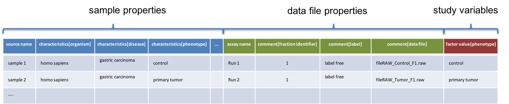
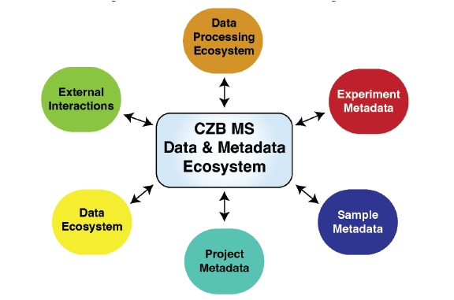
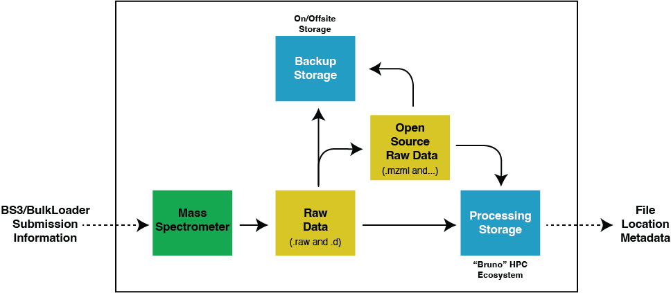
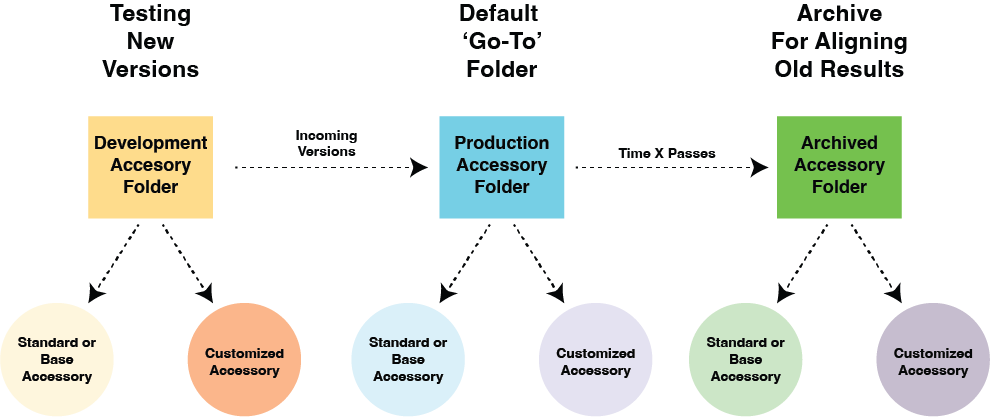
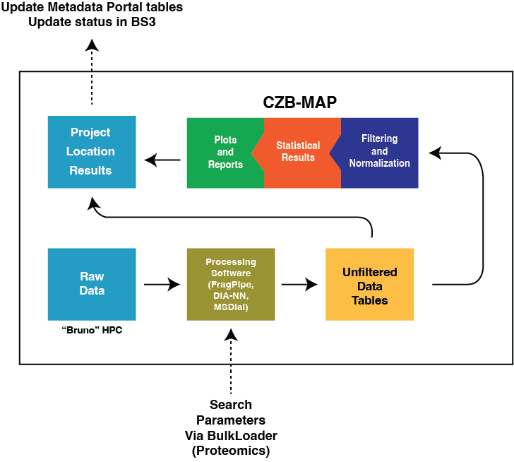
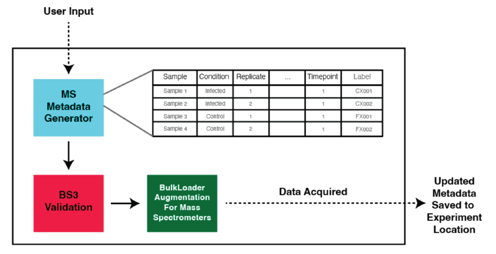
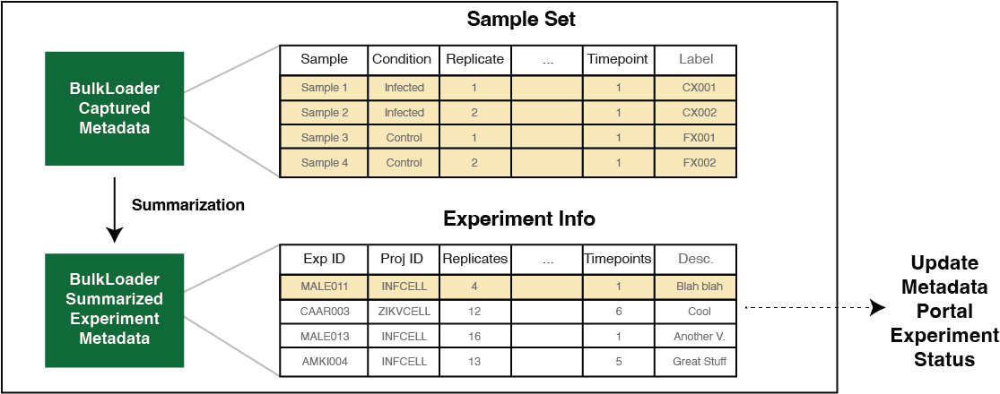
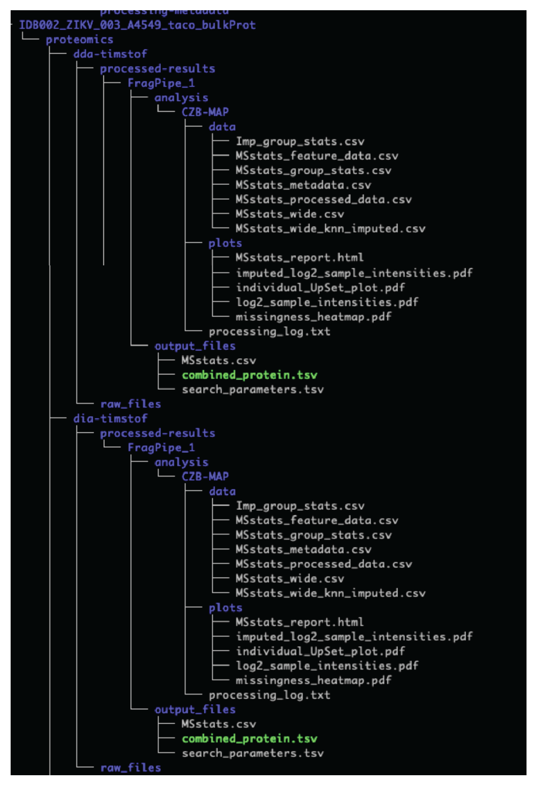
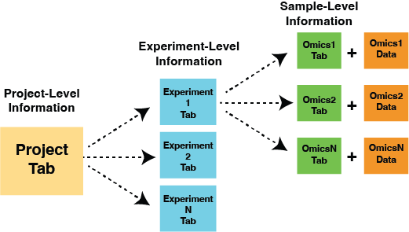

# **CZB Mass Spectrometry Data and Metadata Schema**

**Version: 1**  
**Effective date: September 27, 2024**  

The key words **"MUST", "MUST NOT", "REQUIRED", "SHALL", "SHALL NOT", "SHOULD", "SHOULD NOT", "RECOMMENDED", "NOT RECOMMENDED" "MAY", and "OPTIONAL"** in this document are to be interpreted as described in [BCP 14](https://tools.ietf.org/html/bcp14), [RFC2119](https://www.rfc-editor.org/rfc/rfc2119.txt), and [RFC8174](https://www.rfc-editor.org/rfc/rfc8174.txt) when, and only when, they appear in all capitals, as shown here.  

## **Executive Summary**

This document outlines the established mass spectrometry data standards within the CZB ecosystem. These standards are designed to:

1. **Facilitate Collaboration:** Standardized processing, analysis, and annotation pipelines enables more seamless cross-group analyses of data.   
2. **Streamline Data Analysis and Reuse:** Packaged data plus metadata contain all aspects necessary to understand datasets without additional human intervention.  
3. **Support Ecosystem-Wide Initiatives:** Empower large-scale CZ ecosystem efforts, such as the “Virtual Cell,” since packaged data plus metadata is easier to share and reuse.

### **Data Formats and Associated File Standards** 

Platforms **MUST** generate both vendor-specific file formats such as RAW (.raw) and D (.d) and, where feasible, open-source formats such as mzML (.mzML) for each dataset. Accessory files such as FASTA (.fasta), MSP (.msp), and workflow files **MUST** be named according to a standardized schema and stored in a centralized location.

### **Data Processing and Metadata Standards** 

Raw proteomic data **MUST** be processed using [FragPipe](https://fragpipe.nesvilab.org/), given its compatibility with Bruker timsTOF and Thermo Orbitrap data in both DDA (Data-Dependent Acquisition) and DIA (Data-Independent Acquisition) modes. However, additional search engines **MAY** also be used. All file locations, spectral databases (including FASTA files), and workflows **MUST** be organized in a manner that they can be placed into easily transmissible objects such as “[Big Data Bags](https://ieeexplore.ieee.org/document/7840618)”. Metabolomics data **MUST** be processed using [MS-DIAL](https://systemsomicslab.github.io/compms/msdial/main.html) with an in-house spectral library that is shared across Biohubs. Both proteomics and metabolomics datasets **MUST** undergo initial quality control using [CZB-MAP](https://github.com/czbiohub-sf/CZB-MAP) automated profiling.

### **Sample-Level Metadata Standards** 

Sample-level metadata—such as experimental group, fraction number, and replicate number—are **REQUIRED** to be recorded in a standardized tabular format (see [sample sheet template](https://docs.google.com/spreadsheets/d/1Vrxjci__BztPzuror0W-0tu17ODj_Cx9jA4VChWRf1k/edit?gid=1176499156#gid=1176499156)). The Mass Spectrometry platform is in the process of adopting the MAGE-TAB ([MicroArray and Gene Expression Tabular format](https://github.com/bigbio/proteomics-sample-metadata)) Proteomics standard for capturing proteomics data, with a similar structure planned for metabolomics data.

### **Project- and Experiment-Level Metadata Standards** 

[Project-](https://docs.google.com/spreadsheets/d/1-1-8rzndmKD3sTS9kWGpnqmuvZQpsDkYYUdG0sr3YSw/edit?gid=0#gid=0) and [experiment-level](https://docs.google.com/spreadsheets/d/1R1gkZOQFcTex5eC2NjGnizRvYsBPJzlqOa_0US7RXt4/edit?gid=0#gid=0) metadata are modeled after the ISA-Tab ([Investigations, Studies, and Assays](https://isa-tools.org/index.html)) standard and **MUST** include both platform IDs and CZB Metadata Portal IDs, ensuring that all files related to specific projects are identifiable at the platform level and in the context of their related datasets. APIs for the CZB Metadata Portal **SHOULD** facilitate the integration of this metadata with projects.

### **Considerations for secondary analysis and external transmission**

To enable reanalysis efforts and AI integration, all critical metadata **MUST** be available to be packaged and maintained within “[Big Data Bags](https://ieeexplore.ieee.org/document/7840618)” for external transmission. These packages will include dynamic links to file locations, sample and experiment information, data tables, machine and search information, and a comprehensive list of all files. Standardization of file inclusion and folder structure within Big Data Bags is **REQUIRED** to support easy API-based data ingestion.

---

## **Table of Contents**

[I. Motivation](#i-motivation)

[II. Objective](#ii-objective)

[III. Key Terms and Software Descriptions](#iii-key-terms-and-software-descriptions)

[IV. Influential Works](#iv-influential-works)

[V. Summary of Data and Metadata Ecosystem](#v-summary-of-data-and-metadata-ecosystem)

[VI. CZB Raw Data Handling Standards](#vi-czb-raw-data-handling-standards)

[VII. CZB Data Processing Metadata Standards](#vii-czb-data-processing-metadata-standards)

[VIII. CZB Sample-level Metadata Standards](#viii-czb-sample-level-metadata-standards)

[IX. CZB Experiment-level Metadata Standards](#ix-czb-experiment-level-metadata-standards)

[X. CZB Project-Level Metadata Standards](#x-czb-project-level-metadata-standards)

[XI. Platform Ontology and Annotation Standards](#xi-platform-ontology-and-annotation-standards)

[XII. Data Packaging for External Transmission](#xii-data-packaging-for-external-transmission)

 
---

## I. Motivation

Mass spectrometry (MS)-based profiling of biological conditions plays a crucial role in many flagship projects in the CZ ecosystem, generating extensive datasets that inform the primary research and also provide valuable secondary data for other experiments and AI-driven biological model training. To maximize the utility and reusability of MS datasets, it is essential to establish common data and metadata standards that enable their effective integration with linked multi-omic datasets. By adhering to FAIR (Findable, Accessible, Interoperable, and Reusable) principles, these standards ensure that the data is valuable for both internal projects and the broader scientific community. This document outlines CZ Biohub’s data and metadata standards, guiding the generation, storage, and record-keeping of our MS data.

## II. Objective

**Describe, in detail:**

* MS data and metadata standards and the rationale for selecting specific standards  
* how these standards are implemented within the CZB Mass Spectrometry Platform  
* the interaction between MS data and metadata standards and other CZB systems  
* methods for accessing MS data and their associated metadata

## III. Key Terms and Software Descriptions

**Definitions of terms used throughout this document:**

1) **Project:** metadata concept that groups a set of experiments aimed at answering a specific question as part of a planned aggregation. This does not include biological associations that occur by chance (e.g., two separate experiments by different investigators studying the Zika virus’s effect on host metabolism). A project may encompass a single experiment or multiple experiment sets.  
2) **Experiment:** a set of samples grouped together for MS profiling and analyzed collectively downstream.  
3) **Specimen:** material (biological or non-biological) from which one or more samples can be derived.  
4) **Sample:** a single entity subjected to specific experimental conditions, represented by a single row of metadata in a table.  
5) **BS3 (Biohub Sample Submission System):** custom-built web application that collects user information on proposed and approved projects/experiments, which is then passed to other internal applications.  
6) **Metadata Portal:** custom-built web application that records datasets from multiple platforms at Biohub (including mass spectrometry, sequencing, and imaging).   
7) **BulkLoader:** local custom-written application running on computers interfacing with CZB mass spectrometers (currently operational in SF and being ported to CHI). It manages several functions that include file management, mass spectrometer queue management, and the automation of raw data search operations.

## IV. Background on Data and Metadata Standards 

### Data Format Standards 

Manufacturer-specific file formats like RAW (Thermo Scientific) and .d (Bruker) are optimized for their ecosystems but are not open-source, requiring significant investment to use. In response, the MS community developed open-source alternatives that are interoperable with major platforms and accepted by public repositories. The biological data type (metabolomics or proteomics) is irrelevant to these standards.

Open-source data formats like mzData and mzXML initially emerged in 2003 but were replaced by mzML in 2008\. [mzML](https://www.ncbi.nlm.nih.gov/pmc/articles/PMC3073315/) is now a major open-source standard that is both widely used and [actively maintained](https://github.com/HUPO-PSI/mzML). It is preferred by many analysis tools and public repositories. mzML files are easily converted from the RAW format using tools like [ProteoWizard](https://proteowizard.sourceforge.io/) and [ThermoRawFileParser](https://github.com/compomics/ThermoRawFileParser). Bruker’s timsTOF machines generate .d folders, which can be converted to mzML, though with [limitations](https://fragpipe.nesvilab.org/docs/tutorial_convert.html) like missing ion mobility data for MS1 quantification. Despite this, free software, supported by Bruker’s SDK and [OpenTIMS](https://github.com/michalsta/opentims), can natively read and search .d folders, making the lack of conversion alternatives less critical for CZB standards.

Other storage formats, such as [HDF5 variants](https://www.mcponline.org/article/S1535-9476\(20\)30559-4/fulltext), have been proposed and offer extremely fast and efficient read/write access and a flexible structure ideal for MS data and metadata. While these formats currently lack native support on major search platforms, this is beginning to change with emerging support from platforms like [Alphapept](https://www.nature.com/articles/s41467-024-46485-4) and [SkylineMS](https://skyline.ms/). As this area evolves, these formats may influence CZB MS data and metadata standards in the near future.

### Sample Metadata Format Standards 

CZB is committed to adopting FAIR principles for sample-level metadata standards. A significant data format that was developed for organizing and sharing experimental metadata in a standardized way is [MAGE-TAB](https://www.ebi.ac.uk/training/online/courses/array-express-discover-functional-genomics-data-quickly-and-easily/how-are-datasets-submitted-and-stored-in-arrayexpress/metadata-is-stored-in-mage-tab-format/), which was originally created for microarray data but now widely used in transcriptomics. MAGE-TAB is a standardized tabular format that records necessary and customizable metadata categories for each sample on a row-by-row basis. It has been extended by the Human Proteome Organization’s (HUPO) Proteomics Standards Initiative (PSI) to accommodate proteomics data.

  
   
  <em>Source: HUPO PSI documentation</em>

The MAGE-TAB Proteomics format consists of two components: 1\) the IDF (Investigation Description Format) file, an XML (.xml) file generated by [PRIDE’s submission tool](https://www.ebi.ac.uk/pride/markdownpage/pridesubmissiontool), capturing experiment-level metadata, and 2\) the SDRF-Proteomics (Sample and Data Relationship Format for Proteomics) file, a tabular file recording sample-level metadata, including sample conditions, manipulation, chemical labeling, etc, and their corresponding data files (e.g. RAW, mzML, or .d). MAGE-TAB Proteomics' compatibility with ProteomeXchange standards and its extensibility make it a highly attractive system for CZB.

The MAGE-TAB Proteomics format may also be adapted for metabolomics and lipidomics, with export scripts transforming it into [mwTab](https://github.com/MoseleyBioinformaticsLab/mwtab) (.mwTab) format for ease of submission to metabolomic file repositories ([Metabolomics Workbench](https://academic.oup.com/nar/article/44/D1/D463/2502588) and its European counterpart [MetaboLights](https://www.ebi.ac.uk/metabolights/)).

### Experiment and Project Metadata Format Standards

Experiment- and project-level metadata often include standardized parameters, but to ensure completeness, they also require more free-form entries. As such, metadata standards at these levels must support a combination of structured fields and flexible content. The [Investigation, Study, Assay](https://isa-tools.org/index.html) (ISA) framework provides a standardized structure for organizing experiment- and project-level metadata, supported by a suite of [tools](https://github.com/orgs/ISA-tools/repositories?type=all) that facilitate metadata curation, validation, and conversion into interoperable formats. The [ISA-TAB](https://isa-specs.readthedocs.io/en/latest/isatab.html) file format provides a structured yet flexible framework that combines standardized fields with extensibility in a tabular format. In particular, the “Investigation” tables, whose goal is to provide information on the investigation, study, and assay in a columnar fashion, would be easily parsed by tools. While not all fields are useful for our purposes, we can modify the included information for use as a base to generate a metadata standard. Of note, some fields required for **compliance** with ISA-TAB standards are likely to cause significant collection issues and/or are not applicable (this view is also informed by CZI CellxGene metadata teams’ experience). Thus, while we will use ISA-TAB as a base, the categories collected will largely be a mix of ISA-TAB standardized and custom categories. We will, as much as possible, attempt to adhere to the standards and, if necessary, backfill categories we do not collect prior to any repository submission. 

### Supporting File Standards

#### File Naming Standards

Standardizing file naming for supporting files, such as workflow and FASTA files, is crucial for ensuring consistent results across experiments. For example, a standardized FASTA file naming convention can ensure the same sequences are searched across a group of experiments, facilitating future comparisons using the same search parameters. Despite the importance, there has yet to be a concerted effort within the MS community to establish file naming best practices. As such we have added naming conventions for all files, which can be seen at various sections in this document.

#### File Internal Formatting

FASTA files identify a protein via its metadata and sequence but have limitations. Minimally encoded information can hinder downstream analysis, and the lack of annotations for attributes such as sequence variants and post-translational modifications (PTMs) can bloat files with multiple forms of the same protein, posing a challenge in proteogenomics. HUPO-PSI addressed these issues with Protein Extended FASTA Format (PEFF), adding header information. More recently, ProForma 2.0 notation was developed to encode proteoform data, but support for [PEFF](https://www.ncbi.nlm.nih.gov/pmc/articles/PMC6642660/) and ProForma 2.0 is still limited, with [ProForma 2.0](https://www.ncbi.nlm.nih.gov/pmc/articles/PMC7612572/) not yet supporting multi-protein searches. While both formats are of interest in the future, their current limited support within search engines limits their utility to the platform.

### Aggregate-Level Metadata Standards

Efforts to standardize aggregate-level metadata, covering groups of files and their experimental conditions, have been limited. While sample-level metadata is well-defined, standards for experiment- and project-level metadata are still lacking. The [ISA standards](https://isa-specs.readthedocs.io/en/latest/index.html), designed to capture critical metadata across platforms, should serve as a foundational object included in Biohub “Data Bags” for use in data storage services such as Amazon S3 or Globus.

### Additional Metadata Considerations

Beyond data-centric standards for MS, significant work has been done to standardize the recording of experimental protocols, ensuring consistency in sample processing pipelines. This information is often captured using the ISA framework.

## V. Summary of Data and Metadata Ecosystem

  

#### Data Ecosystem

The data ecosystem encompasses the data types utilized by the CZB MS platform, which currently include vendor-specific formats such as RAW fromThermo Scientific and .d from Bruker, as well as the open-source mzML format for converted files (when possible, from RAW). This setup ensures compatibility with both proprietary and open-source processing environments. File naming standards are dictated by BS3 and BulkLoader interactions, and are detailed in the “CZB Raw Data Handling Standards” section of this document.

#### Sample Metadata

Sample metadata will transition to the HUPO-PSI-derived MAGE-TAB Proteomics SDRF format, as outlined in the previous section, by the end of calendar year 2025\. This transition will facilitate consistent annotation, reanalysis, and integration of sample data across different datasets and CZB sites, enhancing overall data management and interoperability.

#### Experiment Metadata

Experiment-level metadata is primarily derived from the sample metadata ecosystem and additional information from the Biohub Sample Submission System (BS3) and the CZB Metadata Portal. Specifically, sample metadata is used to derive experimental conditions and contextualizes this information with supplementary metadata from the CZB Metadata Portal. Information about experiment-level metadata **MUST** be stored in ISA-derived tabular data.

#### Project Metadata

The project ecosystem provides a high-level tabular summary of projects, their associated experiments, and additional metadata that facilitates integration into other projects for meta-analyses. This “Project-Experiment-Sample” structure is analogous to the ISA standards but with modifications tailored to Biohub’s specific needs. Similar to experiment-level metadata, project-level metadata **MUST** be stored in ISA-like tabular format.

#### Data Processing

The data processing ecosystem records the processes involved in converting raw data into feature-x-sample quantification tables and the subsequent steps taken to transform these tables (e.g., normalization, imputation, and other data cleaning processes). This includes details such as the search engine used, relevant search engine settings, and the FASTA file employed in the search (see the relevant section for more details).

#### External Interactions

The standards for how external systems, such as BS3 and the Metadata Portal, interact with MS data and metadata are currently under discussion. This includes defining database schemas, data transfer methods, and integration with external platforms to ensure smooth interoperability within Biohub systems and beyond.

## VI. CZB Raw Data Handling Standards

The data standards for the CZB MS platform are designed to be efficient and lightweight, focusing on three key areas: **1\)** ensuring that raw files are adequately backed up to prevent data loss, **2\)** reformatting raw data into open-source formats when possible, and **3\)** maintaining consistent conventions for naming and storing accessory files (such as FASTA and workflow files).

### Raw Data Generation and Storage

  

The schema above depicts the processes for generating MS data and moving files from local storage to designated locations for long-term storage and processing. More details follow:

1. **Sample Naming Standards:** Sample (raw file) names are generated by interactions between the BS3 system and BulkLoader, where BS3 passes sample names generated by the user and appends additional method-specific information to. The naming standard has been designed to capture both experimental and method information and goes as follows: ExperimentGroup\_PrepMethod\_Fx\_Ry\_Tz\_ExtendedMethodInformation.raw

   1. **ExperimentGroup:** the experimental group to which the sample belongs.

   2. **PrepMethod:** the method with which the sample was prepared. Default \= “Default”.

   3. **Fx:** Fraction number (e.g., F1, F2, etc) when sample is fractionated. Default \= 1.

   4. **Rx:** Replicate of Experiment Group (e.g, R1, R2, etc.). Default \= 1.

   5. **Tx**: Timeseries ID. Does not need to be time series, but any series data including dilution series. Default \= 1\.

   6. ExtendedMethodInformation: method text appended automatically by BulkLoader, referring to a specific mass spectrometry method used to acquire the data.

   7. When combined, the ExperimentGroup and PrepMethod form the core of the samples grouped together, while the rest of the information allows for the reconstruction of the replicates. For example:

| Experiment Group | Description |
| :---- | :---- |
| DENV\_OrgIP\_F1\_R1\_T1\_timsTOFDIA\_30min\_method.raw | This file would refer to the first replicate of the DENV\_OrgIP group. The data would be captured with the method appended after T1, which is a 30-minute method on the timsTOF in DIA. |
| ZIKVRifampin\_bulk\_F1\_R2\_T2\_Lumos\_DDA\_45Min.raw | This file refers to the second replicate of the ZIKVRifampin\_bulk experiment group. Data would be acquired on the Thermo Fusion Lumos using DDA over a 45-minute gradient. | 

2. **Sample Metadata Input:** Systems such as BS3 and BulkLoader, along with platform personnel, provide sample-level metadata to mass spectrometer-connected computers. This information is delivered as a CSV (.csv) file (Thermo Scientific machines) or an XLS (.xls) file (version 2007-2009) that is read by the mass spectrometer’s built-in import functions. These files contain information for the mass spectrometers to identify sample locations in the HPLC and define how spectra should be acquired (machine-level workflows/parameters).

3. **Spectral Data Acquisition:** The spectral data is written in a vendor-specific format. For Thermo Scientific machines such as the Fusion Lumos or Q-Exactive HF, this results in a RAW binary file, which is not human-readable. For Bruker machines such as the timsTOF-SCP, a .d folder containing the spectral data is generated instead of a single file.

4. **File Storage:** Once the raw spectral data objects are acquired, they are transferred to various storage locations for backup and processing. Currently, these locations include:

   1. **The “Experiment folder” on the CZB HPC (“Bruno”), with the following naming and storage conventions:** 

      * FFFLL0001\_x, where FFF stands for the first 3 letters of the investigator’s first name, LL references the first two letters of their last name, and 0001 references the incrementing experiment number. For instance, files acquired for the experiment “MANLE0001” would be stored under: /hpc/projects/mass\_spec/projects/MANLE0001/raw or /d, depending on file type.

      * For samples analyzed by multiple MS technologies, raw files **MUST** be deposited in folders separated by the acquisition machinery type, resulting in both /d and /raw folders for the same sample set.

   2. **A backup location with an identical “Experiment folder” structure**, e.g., a Box location provided by Stanford Medicine/Healthcare with additional storage on a NAS device at Stanford’s CZB MS facility.

5. **Conversion to Open Source Formats:** When possible, raw files are converted to open-source versions that retain all spectral information. For the CZB MS platform, this is currently limited to mzML files. Note that Bruker .d files are not converted at this time.

6. **Storage of Open-Source Files:** The open-source files **MUST** be stored in the same non-local locations as the raw files and placed in a /mzml folder. This consistent file storage structure is necessary to inform the Metadata Portal and BS3 systems about the file locations.

### Accessory Files

  

Accessory file standardization is crucial for maintaining a consistent and predictable data handling and processing environment. Given the myriad of parameters these files contain, even small changes can have significant impacts on the outcomes and as such must be standardized. **Accessory files include, but are not limited to**:

* FASTA files (containing protein sequences\; plain-text readable)  
* MSP files (metabolomic spectral libraries\; plain text-readable/editable)  
* MSP3 files (exported lipidomics spectral libraries\; text-editable)  
* spectral matching algorithm workflow files (various formats, often human-readable YAML-like or JSON files)  
* spectral matching algorithm parameter files (same as above)

To ensure orderly management, these files will be organized into “**Development**,” “**Production**,” and “**Archived**” folders. This structure will facilitate the selection of optimized files, support the testing of future versions, and provide access to previous versions as needed. These files will be ‘unit tested’ to ensure they provide equivalent or better functionality than previous versions.

The criteria for moving a file from development to production are:

1) For FASTA files, searches are successfully completed on test datasets acquired from the same organism as in the file.  
2) For workflows, 3 datasets will be chosen (based on search type) and searches are successfully completed.  
3) Results from above are extracted and compared to previous results and do not cause an unexplainable loss in correlation at the sample-to-sample level.  
4) Comparisons of peptide and protein IDs are equivalent or increased with the same parameters.

#### Establishment of Test Datasets

In order to facilitate file evaluation as described above, test datasets must be established. These **SHOULD** reflect the most common experimental assay types experienced by the platform, but **MUST** include the following:

1. **Proteomics** \- 5 standards-based label-free runs (e.g., HeLa standard, veal brain, *E. coli*, etc,). At least one **MUST** be human.  
2. **Proteomics** \- 3 label-free experiments.    
3. **Proteomics** \- At least 3 datasets each for any additional common experiment types (TMT-labeled sample sets, MHC immunoprecipitation, etc.). This ensures that a single dataset with either very high or very low quality does not bias unit tests.  
4. **Metabolomics/lipidomics** \- At least 3 datasets for testing new spectral libraries, and at least 10 datasets for testing new versions of MS-Dial.

#### FASTA Files

Standardizing FASTA files is essential for achieving consistent results and enabling cross-omics standardization, particularly between proteomics and transcriptomics. The CZB MS platform has implemented a dual system of standardized (“Base”) and custom FASTA files. A database of FASTA files **SHALL** be established and maintained by BulkLoader, with each file recorded using an auto-incrementing index ID for unique identification and reference purposes, along with the following fields:

| Field | Type | Description |
| :---- | :---- | :---- |
| IndexID | numeric | Unique identifier in database; auto-increments |
| fileName | character | FASTA filename, formatted using the rules outlined below |
| numUses | numeric | Number of times each FASTA file has been used in searches |
| class | character | Identifies Base vs. custom FASTA files (see below for more info) |
| prodCat | character | Current activity category (‘archived’, ‘production’, and ‘development’) |
| addDate | date | Date FASTA file was downloaded |

**Standard (“Base”) FASTA filename conventions**:

* Ensures consistent searches across common organisms from Biohub to Biohub.  
* Serves as a common base for concatenated FASTA files.  
* Focuses on single species.  
* **Format:** DownloadDate\_source\_TaxonName\_additionalAttributes\_standard.fasta  
  * “AdditionalAttributes” can be expanded using dashes to include extra information.  
  * Each section uses camel case (e.g., HomoSapiens).  
  * The scientific taxon name will be used as the primary source identifier, in camel case.  
  * Date should be formatted using [ISO8601](https://www.iso.org/iso-8601-date-and-time-format.html) standards (YYYYMMDD).  
  * **Examples**:  
    * 20240727\_uniprot\_HomoSapiens\_Swissprot\_standard.fasta  
    * 20240624\_uniprot\_DanioRerio\_Swissprot-Trembl\_standard.fasta

**Custom FASTA filename conventions:**

* Provides flexibility in searching sequences, with the added benefit of being concatenated from a common sequence source.  
* Sequestered to a custom folder to be reusable without affecting standardized sequences.  
* The date corresponds to when the custom file was created.  
* Each section can use dashes to include additional data sources.  
* Custom files may have relevant information appended to the “AdditionalAttributes” section, such as custom sequences, concatenated versions of standard FASTA files, or a combination thereof.  
* **Format:** CreationDate\_sourceTaxa\_additionalAttributes\_custom.fasta  
  * As before, “AdditionalAttributes” can be extended by using dashes.  
  * Date should be formatted using ISO8601 standards (YYYYMMDD).  
  * **Examples:**  
    * 20240730\_uniprot-Cov2Sequencing\_HomoSapiens-COV2\_CowContam-rev-unrev\_custom.fasta  
    * 20240520\_refseq-wgc\_HomoSapiens-Cohort34\_TLG34\_custom.fasta

#### Spectral Libraries \- Proteomics

Spectra libraries **MUST** be formatted in a similar manner to those of custom FASTA files. Since proteomic spectral libraries are generated from DDA runs using a standard FASTA file, this file **MUST** be referenced via a combination of the source acronym and species name.

Acceptable source acronyms are:

* **UP** \= Uniprot  
* **RS** \= RefSeq

Alternatively, the FASTA database indexID can be used:

* **Formats:**

  Date\_FastaID\_taxa\_AdditionalInfo\_custom.tsv or .speclib

  Date\_sources\_taxa\_AdditionalInfo\_custom.tsv or .speclib

  * Date should be formatted using ISO8601 standards (YYYYMMDD).  
  * **Examples:**  
    * 20240345\_23-43-45\_HomoSapiens-EscherichiaColi-DanioRerio\_SISO003\_custom.tsv  
    * 20240523\_UP-UP\_DanioRerio-KlebsiellaPneumoniae\_SIFA002\_custom.speclib

#### Spectral Libraries \- Metabolomics

Metabolites have little to no species specificity and thus do not require species-specific spectral libraries. CZB metabolite spectral libraries come from local and global sources.

* **Local metabolite spectra:** Spectra collected from authentic standards using conserved chromatography (i.e., Biohub-HILIC or Biohub-C18), allowing the highest confidence annotations by matching retention time, MS1, and MS2 spectra. 

* **Global metabolite spectra:** generated from external sources without known retention times, resulting in lower confidence annotations. See metabolomics standards initiative publications ([2007](https://link.springer.com/article/10.1007/S11306-007-0082-2), [2014](https://pubs.acs.org/doi/full/10.1021/es5002105)) for more details.

The spectral libraries for metabolomics are curated in-house and updated periodically. They are stored in the MSP file format, with filenames reflecting the date of the last update. When MS-Dial processes an experiment, the library used is copied to the local folder and stored alongside the results files for future reference. These files **MUST** adhere to the following convention: ModeLibrary\_Chromatography\_VersionDate.msp

* **Example:** negMSP\_HILIC\_Oct2023.msp

#### Spectral Libraries \- Lipidomics

Spectral libraries for lipidomics are IBM2 (.ibm2) files embedded in the MS-Dial version used. These files are not text-readable. Similar to metabolomics libraries, lipidomics libraries are saved in the project folder and kept with the result files for later reference as MSP2 files. They are date- and time-stamped at the time of processing. Formatting **MUST** adhere to the following convention: year\_month\_day\_hour\_minute\_second\_Loaded.msp2

* **Example:** 2024\_8\_5\_14\_14\_20\_Loaded.msp2

#### Software Workflow Files

Workflow file standardization is equally critical for ensuring consistent search results. As with FASTA files, workflow files should be organized into subsets to support both standardized searches—suitable for the majority of experiments—and custom search parameters designed for specific purposes. Given the variety of search software available, it is beyond the scope of this document to enumerate every parameter and workflow file. However, the following naming conventions **MUST** be applied, similar to those used for FASTA files, with some modifications.

**Standardized workflow files:**

* Ensure consistent search parameters across common organisms, from search-to-search, and across Biohubs.  
* Focus on standardizing and streamlining common search procedures.  
* **Format:** DateMade\_SoftwareVersion\_PertinentInfo1-PertinentInfo2.workflow  
  * **Example:** 20240403\_FP22\_phosSTY-DIA.workflow

**Customized workflow files:**

* Allow for customized workflows targeting specific needs, such as the consistent searching of PTMs or diagnostic ions.  
* Stored for easy identification and consistent reuse across projects.  
* “PertinentInfo” can be more specifically tailored to a project to avoid excessive detail in the filename.  
* **Format:** DateMade\_SoftwareVersion\_PertinentInfo1-PertinentInfo2.workflow  
  * Example: 20240403\_FP22\_TLG1002-phosSTY-DIA-DDA.workflow

## VII. CZB Data Processing Metadata Standards

  

Data processing encompasses the computational transformation of raw spectral data (whether in open-source or vendor-locked format) into human-readable feature x sample tables, as well as the downstream processing of these tables, including normalization, transformations, and general statistical analyses. For proteomics, we currently utilize several search platforms, including MaxQuant, FragPipe (v22), DIA-NN, and PEAKS. FragPipe is the default search engine for automated searches due to its command-line compatibility. In metabolomics, MS-Dial is the primary tool used for matching spectra to features.

#### Raw → Unfiltered Tables

While the general structure of the data processing pipeline is similar for both proteomics and metabolomics, the specific details—especially concerning the software used to match spectra to features—vary. The intricacies of each workflow file used by the platform are beyond the scope of this document. However, below are the details of settings used to search a typical label-free dataset. This example is provided solely to illustrate the **type of data** collected in workflow files; actual workflow files capture much more extensive parameter information:

**Proteomics:**

1) **DDA Fusion Lumos-Generated Data**   
   1) Searched with: FragPipe (currently v22)  
   2) Standard workflow parameters: DDA, LFQ, MBR  
      * MBR Settings: At least 1 ratio per calculation  
   3) Peptide modifications (static): carbamidomethylation (C)   
   4) Peptide modifications (dynamic): phosphorylation (STY), oxidation (M)  
   5) Mass shifts allowed for matching: 20 ppm  
   6) Peptide FDR: 0.01  
   7) Protein FDR: 0.01

2) **DIA timsTOF-Generated Data**  
   1) Searched with: FragPipe (currently v22)  
   2) Standard workflow parameters:  
   3) Peptide modifications (static): carbamidomethylation (C)   
   4) Peptide modifications (dynamic): phosphorylation (STY), oxidation (M)  
   5) Mass shifts allowed for matching: 20 ppm  
   6) Peptide FDR: 0.01  
   7) Protein FDR: 0.01

Searches output several files, of which **“combined\_protein.tsv”** and **“combined\_peptide.tsv”** are important for general analysis. Because we use the [MSstats](https://github.com/Vitek-Lab/MSstats) statistical package for downstream analysis, the **“MSstats.csv”** file is also a critical part of our processing pipeline. 

**Metabolomics/Lipidomics:**

1) DDA Q-Exactive HF-Generated Data  
   1) Searched with: MSDial (currently v4.9.221218)  
   2) Standard workflow parameters (listing diversions from defaults):   
      1) Data collection:  
         1) MS1 tolerance: 0.01  
         2) MS2 tolerance: 0.015  
      2) Peak detection:  
         1) Minimum peak height: 50k–100k depending on study design  
      3) Identification:  
         1) Lipids:   
            1) Select appropriate buffer for polarity  
            2) RT tolerance: 100 min  
            3) Accurate mass tolerance (MS1): 0.01  
            4) Accurate mass tolerance (MS2): 0.015  
            5) Score cutoff: 70%  
         2) Metabolites:   
            1) RT tolerance: 0.4 min  
            2) Accurate mass tolerance (MS1): 0.01  
            3) Accurate mass tolerance (MS2): 0.015  
            4) Score cutoff (filtered downstream): 40%  
            5) Use RT for scoring: check  
            6) Use RT for filtering: check  
      4) Alignment:  
         1) Retention time tolerance: 0.05–0.2 min depending on chromatography  
         2) MS1 tolerance: 0.015  
         3) Peak count filter (%): 0–100 depending on study design  
         4) N% detected in at least one group: dependent on study design

#### Unfiltered Tables → Processed Results

**CZB-Mass Spectrometry Analysis Platform (CZB-MAP)**

CZB-MAP is CZB’s in-house MS data processing and quality control platform designed to handle both proteomic and metabolomic data. The platform’s workflows are currently being developed using NextFlow pipeline software, with Python and R employed for file processing and generating user reports. While the technical workings of CZB-MAP are beyond the scope of this document, it is important to note the critical functions it performs:

* **Data Processing:** CZB-MAP automates the processing of raw data into usable formats, integrating various software tools and custom scripts to ensure consistent and accurate results.

* **Quality Control:** The platform includes robust quality control measures to assess data integrity and identify any issues that may affect downstream analyses.

* **Reporting:** CZB-MAP generates detailed user reports that summarize processing outcomes, quality control metrics, and any adjustments made during the workflow.

This document will not delve into the specific details of CZB-MAP’s architecture or implementation, but its role in ensuring data reliability and consistency is vital for the overall success of proteomic and metabolomic analyses within CZB.

1) **Proteomics**

   1) Uses [MSstats](https://github.com/Vitek-Lab/MSstats) to process both DDA- and DIA-acquired data.  
   2) Several standard parameters set in pipeline:  
      1) **Normalization:** median scaling per sample and Tukey’s Median Polish enabled by default  
      2) **Quality filtering enabled:** removes low quality features  
      3) **Imputation:** uses Accelerated Failure Time model to impute features reaching certain thresholds  
         * Imputation is done at the feature level (peptide \+ charge \+ mod combination).  
   3) We also impute NA values from MSstats using 1/10 the minimum value of the corresponding sample. This enables additional analysis and plotting of data that would be unavailable without complete imputation (which is not currently built into MSstats).  
   4) Returned tables are a feature x sample matrix of log2 protein intensity values.

2) **Metabolomics**

   1) No normalization is enabled by default (log2 transformation is standard), but CZB-MAP has the capability to do so.  
   2) Missing values are imputed using 1/10 the minimum value of the corresponding sample.

All tables (non-normalized, normalized, non-imputed, imputed) are saved to the CZB-MAP “data” folder for further usage.

| Folder | Description |
| :---- | :---- |
| Data | Houses all .csv tables generated by CZB-MAP (see table below for file descriptions) and commonly output tables from search software |
| Plots | Houses all plots and reports generated by CZB-MAP |

#### Processed Results → Save Outputs to Experiment Location

The pipeline outputs several tables, plots, and summaries for the files in the experiment. Below are tables outlining the data output and description.

| Proteomics Output | Description |
| :---- | :---- |
| combined\_protein.tsv | Protein-level output from FragPipe. Contains extensive information about the various quantification values assigned to proteins for all samples searched. |
| combined\_peptide.tsv | Peptide-level output from FragPipe. Contains extensive information about the various quantification values assigned to peptides for all samples searched. |
| MSstats\_raw.csv | Unmodified MSstats-generated input table |
| MSstats\_processed\_data.csv | Processed MSstats-summarized table of protein-level intensities |
| MSstats\_wide.csv | Processed wide-form (protein x sample) intensities table |
| MSstats\_wide\_imp.csv | Same as wide format above but with additional imputation |
| MSSstats\_group\_stats.csv | MSstats-generated statistical results (all vs. all comparison at protein level) |
| Imp\_group\_stats.csv | Stats calculated using Welch’s t-test \+ BH post-hoc test |
| MSstats\_feature\_data.csv | Metadata for proteins found in experiment |
| MSstats\_metadata.csv | Metadata for samples used in processing |
| Msstats\_peptide\_feature\_data.csv | Peptide-level data generated by MSstats |

| Metabolomics Output | Description |
| :---- | :---- |
| Sample\_metadata.csv | Metadata for samples used in processing. This is used for both all annotated data as well as positive-mode data. |
| Neg\_sample\_metadata.csv | Sample metadata for **negative**\-mode data |
| Formatted\_raw\_data.csv | Filtered raw (non-transformed) feature x sample data. Only annotated features. |
| Formatted\_pos\_raw\_data.csv | Filtered raw (non-transformed) **positive**\-mode feature x sample data. Contains additional columns related to features. |
| Formatted\_neg\_raw\_data.csv | Filtered raw (non-transformed) **negative**\-mode feature x sample data; contains additional columns related to features |
| Min\_df.csv | Filtered feature x sample table. **Only annotated features** from both positive and negative modes. |
| Pos\_mode\_min\_df.csv | Filtered feature x sample table. All positive-mode features (annotated and unannotated). |
| Neg\_mode\_min\_df.csv | Filtered feature x sample table. All negative-mode features (annotated and unannotated). |
| Experiment\_classyfire\_annotations.csv | ClassyFire chemical taxonomy table for identified metabolites |
| Feature\_annotations.csv | Additional annotations appended for identified proteins or metabolites (e.g., KEGG IDs, Entrez IDs, etc.) |
| Normalized\_data.csv | Log2-normalized annotated data. Annotated data only. |
| Normalized\_pos\_data.csv | Log2-normalized annotated data. Positive-mode data only. |
| Normalized\_neg\_data.csv | Log2-normalized annotated data. Negative-mode data only. |
| Group\_significance\_testing.csv | All vs. all statistical comparisons for annotated data |
| Pos\_mode\_group\_significance\_testing.csv | All vs. all statistical comparisons for positive-mode data |
| Neg\_mode\_group\_significance\_testing.csv | All vs. all statistical comparisons for negative-mode data |

## VIII. CZB Sample-Level Metadata Standards

  

Sample-level metadata is *transitioning* to align with the HUPO-PSI standards as defined in the MAGE-TAB-Proteomics SDRF table. While some of the categories captured by the SDRF table are already recorded, full alignment will be achieved in the near future.

The current workflow relies on three separate systems:

1) **The MS Metadata Generator:** A small [web application](https://www.shinyapps.io/admin/#/application/10755160:~:text=https%3A//czbiohub.shinyapps.io/Validators/) that guides Mass Spectrometry Platform users through the creation of sample-level metadata.

2) **BS3 Validation:** BS3 takes in user-generated metadata and validates user data to ensure metadata information is filled out correctly.

3) **BulkLoader Integration**: Once the metadata is validated by BS3, it is passed on to BulkLoader, where additional metadata is appended to each sample row. This enriched metadata is then used to generate queue information for the mass spectrometers and is also logged internally to track experiment information on the HPC. In the near future, this information will also be fed back to the BS3 system, allowing it to store metadata for use in other applications.

#### Capturing User Metadata with BS3 and BulkLoader

Currently, BS3 passes user-generated metadata to BulkLoader, which appends additional MS-specific information to each sample/row. BulkLoader operates on a machine-specific basis, meaning each mass spectrometer has an instance of BulkLoader running on its connected computer. BulkLoader writes data to various tables within a local SQLite database specific to each MS machine. Amongst this information, it captures most sample-level metadata currently stored in the x\_bulkLoadPerLoad table (where *x* represents the modality type: ‘p’ for proteomics and ‘MB’ for metabolomics).

**Table of categories captured by BS3 \+ BulkLoader:**

| Category | Type | Required? | Description |
| :---- | :---- | :---- | :---- |
| ID | numeric | Yes | Incrementing numeric ID for each machine |
| Samplename | string | Yes | Name of sample. Reflects experimental condition (e.g., “Zika virus 15hr”), without reference to a replicate name |
| Species | string | No | Currently an uncontrolled vocabulary field reflecting the species being searched |
| Replicate | numeric | Yes | The number of replicates for a condition, which is stored in the sample name  |
| Preparation | string | Yes | How biological material sample is derived |
| Preparationdescription | string | No | Verbose description of sample preparation |
| Fractiondescription | string | No | Description of fractionation method |
| Multiplexing | string | Yes if labeled; No if label-free | For labeled peptides, identifies the channel (TMT channel) or mass offset (light/heavy) |
| Format | string | No | Format of delivered sample (tube, PCR plate, etc.) |
| Label | string | No | Label of physical sample (e.g., tube label) |
| Form | string | No | Physical form of delivered peptides/sample |
| Quantitysubmitted | numeric | No | Amount of sample delivered |
| Unit | string | No | The unit of measurement for the quantity of sample submitted |
| Notes | string | No | Any additional notes about the sample |
| ProjectID | string | Yes | Internal MS Platform Experiment ID |
| PlateID | string | Yes | Plate number sample is delivered with (if multiple plates are delivered). |
| WellPosition | string | Yes | Location on plate of sample |
| InjectionVolume | string | No | Volume of sample injected into mass spectrometer |
| LCMSMethod | string | No | LCMS gradient method used |
| methodName | string | No | MS method used |
| bulkLoadsld\_ID | string | Yes | sld ID, refers to sld object entered into MS computer to populate fields correctly in MS queue |
| Timepoint | numeric | Yes | Timepoint of sample, if any; default is 1 for no timepoints |
| Serialized\_ID | string | Yes | Concatenated string of Samplename \+ Preparation \+ Fraction \+ Replicate \+ Timepoint \+ MS method |
| CZBSF\_PID | string | Yes | Required to return information to Metadata Portal about linked Projects |
| CSBSF\_EID | string | Yes | Required to return information to Metadata Portal about linked Experiments |
| platform\_UID | string | Yes | Automatically generated concatenation of MS type (proteomics or metabolomics) \+ machine name \+ ID field. Allows for distinguishing between different run types on different machines. |

## IX. CZB Experiment-Level Metadata Standards

  

Experiment-level metadata captures summary information about an entire experiment, rather than being associated with individual samples. An experiment encompasses a batch of samples that are prepared and run on the mass spectrometer with the aim of answering a specific research question.

* **Defining an Experiment:** An experiment is considered complete once all samples initially listed on the sample-level experiment metadata sheet have been processed. Any additional samples added later are treated as a separate experiment to maintain the integrity and completeness of the original experiment.

* **Data Sources:** Experiment-level metadata is derived from both user input submitted through the BS3 system and the sample-level metadata. This combined information provides a comprehensive overview of the experiment.

* **Tracking and Linking Datasets:** We are implementing tracking IDs that will allow us to associate experiments with linked datasets captured by different modalities. This integration will enable more seamless cross-modality analyses and enhance the overall data management framework.

#### Captured Metadata

Currently we capture the following information:

| Field | Generating Agent | Description |
| :---- | :---- | :---- |
| Experiment ID | Metadata Portal | CZB Metadata Portal Experiment ID |
| Experiment Name | BS3 | Name entered in BS3 |
| Investigator | BS3 | Primary Investigator for experiment |
| MS Platform ID | BulkLoader | Internal experiment ID |
| Description | BS3 | User entered description of experiment |

#### File Storage Structure

This section outlines a proposed folder structure for cataloging and saving experimental data. The primary goal is to standardize the organization of stored files across experiments, whether they involve a single or multiple modalities. A consistent folder structure will facilitate manual searches for important raw files or results and ensure reliable access for API calls from external systems. Key considerations:

* **Uniform structure across experiments:** Regardless of the experimental scope, the folder structure should remain consistent. This uniformity will simplify the process of locating and accessing files, both manually and programmatically.

* **Proposed structure:** Below is a draft folder structure. Note that this is subject to change based on further discussion and agreement within the platforms.

  

**Description of each folder in the hierarchy:**

| Folder | Content Source | Content Description |
| :---- | :---- | :---- |
| Experiment Root Folder | Search engines, BulkLoader, BS3, CZB-MAP (and other analysis tools), mass spectrometers | All mass spectrometry data for a specific experiment |
| Proteomics | Search engines, BulkLoader, BS3, CZB-MAP (and other analysis tools), mass spectrometers | All proteomic data for a specific experiment |
| Metabolomics | Search engines, BulkLoader, BS3, CZB-MAP (and other analysis tools), mass spectrometers | All metabolomic data for a specific experiment |
| processed-results | Search engines, BulkLoader, CZB-MAP (and other analysis tools) | All processed results from various sources. Results are broken down by search engine and mass spectrometer. |
| raw-files | Mass spectrometers | Raw data (vendor and open source format) |
| reference-info | Search engines, BulkLoader | Accessory files (workflow, FASTA files, etc.) and sample-level metadata |

#### Multi-Search Experiments

Acquired spectral data are often re-searched with different workflows or parameters, with different reference databases, or simply to correct for errors that caused the search to fail. For this reason, each search engine result **MUST** be appended with a “machine\_x” with x signifying an incrementing numeric ID (in the screenshot above this relates to the “/Fragpipe/Lumos\_1”). All searches **MUST** begin the increment with “\_1”. Here are some examples of cases where this becomes critical:

* For re-searches focused on **correcting a search** that failed due to error:

  * Append an “\_e” to the name of the folder with errors (e.g., “Lumos\_1\_e”).

  * Start the next search with modified search parameters in a new folder using the standard annotation “machine\_x”, with *x* signifying the **same incremented number** of the errored run (e.g., “Lumos\_1”).

  * Once results are confirmed to be satisfactory, delete the previous result folder with errors (“Lumos\_1\_e”).

* For re-searches focused on **adding dimensions to the original search** (e.g., searching for PTMs):

  * Start the next search with modified search parameters in a new folder using the standard annotation “machine\_x”, with *x* signifying the **next** incremented number, using the last deposited run as a reference (e.g., Lumos\_2).

  * All results are kept, and no results are deleted.

## X. CZB Project-Level Metadata Standards

Similar to experiment-level metadata, project-level metadata refers to aggregate metadata about projects. Projects can have multiple experiment sets aimed at answering research questions. Programmatic access to project-level metadata is beyond the purview of the current MS standard. However, these data will largely be handled by the Metadata Portal and BS3. Future iterations of platform standards should explore avenues for tracking this information at the platform level.

## XI. Platform Ontology and Annotation standards

To further standardize collected data, we will share biologically relevant ontology standards with CZB’s Metadata Standards. These are built into the sample (MAGE-TAB Proteomics) and experiment-level standards we have developed/accepted/adapted, including the following:

| Standard | Description |
| :---- | :---- |
| [EFO](https://www.ebi.ac.uk/efo/) | Standardized vocabulary designed to provide a structured framework for experimental variables, assays, sample attributes, and other related terms in biomedical research. |
| [MS](https://www.ebi.ac.uk/ols4/ontologies/ms) | Standardized MS terms maintained by HUPO’s PSI group. |
| [NCIT](https://www.ebi.ac.uk/ols4/ontologies/ncit) | National Cancer Institute's terminology ontology library. |
| [UBERON](https://www.ebi.ac.uk/ols4/ontologies/uberon) | Cross-species ontology covering anatomical structures in animals. It provides a standardized framework for describing anatomical entities and their relationships across different species. |
| [NCBITaxon](https://www.ebi.ac.uk/ols4/ontologies/ncbitaxon) | NCBI’s current taxonomic classification schema. |
| [CL](https://www.ebi.ac.uk/ols4/ontologies/cl) | An ontology of cell types. |
| [CLO](https://www.ebi.ac.uk/ols4/ontologies/clo) | The Cell Line Ontology (CLO) is a community-based ontology of cell lines. The CLO is developed to unify publicly available cell line entry data from multiple sources to a standardized logically defined format based on consensus design patterns. |

In addition, protein and metabolite identifications will be appended with several additional annotations. These are generated using the CZB-MAP pipeline and are written to the following files in the /data/ folder:

* **Proteomics:** 

  * MSstats\_feature\_data.csv \- Currently includes only gene annotations, but will soon incorporate Ensembl IDs and Entrez IDs where available. This will facilitate easier cross-omics comparisons and allow for annotations based solely on Ensembl IDs.

  * Future versions will also add GO and KEGG terms for each identified protein.

* **Metabolomics:** 

  * Feature\_annotations.csv \- Includes the following ID types: metabolite, kegg\_ID, accession, name, smiles, chemspider\_id, and chebi\_id.

## XII. Data Packaging for External Transmission

We propose that whenever datasets are shared publicly (outside of the CZ Biohub ecosystem), when they are associated with a manuscript, for example, such datasets should be packaged in “Big Data Bags” (BDBags). The concept of BDBags is introduced [here](https://ieeexplore.ieee.org/document/7840618). BDBags are designed to encapsulate all the necessary metadata required to locate and access large datasets within a small and lightweight package.

#### Key Characteristics of BDBags

* **Comprehensive data capture:** BDBags include all the information needed to correctly integrate a large dataset into a model. This ensures that every necessary file is accounted for and readily accessible.

* **Self-describing package:** BDBags contain metadata that describes the contents of the bag, making it easy to understand what data is included without needing external documentation.

* **Transportability:** BDBags are designed to be platform-agnostic, meaning they can be easily moved between different systems or cloud environments.

* **Interoperability:** BDBags can be integrated with other tools and formats, such as the BagIt format that is used by many digital preservation systems.

* **Data organization:** The format enables the logical organization of datasets and allows for referencing data stored in different locations (e.g., remote URLs).

* **Data integrity:** BDBags use checksums to ensure that the data has not been altered during transfer or storage. This is crucial for scientific reproducibility.

* **Living objects:** BDBags are dynamic, with the ability to be updated if files are moved or reprocessed. This feature is crucial for maintaining the integrity and accessibility of data as it evolves over time.

#### Platform Utilization of BDBags

We have taken inspiration from both ISA standards and BDBags to design an easily maintainable and transferable knowledge object. Mass spectrometry BDBags will contain information about the project, experiment, and assay in separate files, described below.

  

**Project tab-delimited file:** [ISA-style tab-delimited file](https://docs.google.com/spreadsheets/d/1-1-8rzndmKD3sTS9kWGpnqmuvZQpsDkYYUdG0sr3YSw/edit?gid=0#gid=0). This file is modified from ISA’s original structure to tailor to the characteristics of Biohub data.

**Experiment tab-delimited file:** [ISA-style tab delimited file](https://docs.google.com/spreadsheets/d/1R1gkZOQFcTex5eC2NjGnizRvYsBPJzlqOa_0US7RXt4/edit?usp=sharing). This file is modified from ISA’s original structure to tailor to the characteristics of Biohub data. 

**Sample tab-delimited file:** MAGE-TAB Proteomics ([described above](#sample-metadata-format-standards)) will take the place of the ISA tabular document.

**Omics linking tables:** A text file allowing users to link additional modalities to MS data (or other MS experiments such as linked metabolomics and proteomics).

**Omics data tables:** Processed and raw abundance tables for both metabolomics and proteomics.

**Additional MS assay and search information:** Mass spectrometer information and search parameter files that allow users to replicate the current results.

**Fetch file:** A document referencing either the files on the local HPC or their deposition ID on mass spectrometer raw file exchanges.

**BDBag files:** Files that list information about the version of the BDBag downloaded as well as a summary of content in the bag.

#### Data transmission and BDBags

MS data will play a crucial role in wide-scale reanalysis efforts and generating cellular and pathological models. For these applications it is essential to optimize folder and file structures to support biological model building (an approach referred to as ‘[model-driven organization](https://www.isi.edu/isr/wp-content/uploads/sites/8/2023/12/accelerating-data-driven.pdf)’). We believe that BDBags fulfill this purpose and can help ensure seamless data integration with AI models such as “Intracellular Dashboard” and “Virtual Cell.” 

---

**Version History**

**\-----------**

**Version 1, 2024/09/27**

**Authors:** Joan Wong, Carlos Gonzalez, Josh Elias, Brian DeFelice, Ryan McClure

**Contact:** [joan.wong@czbiohub.org](mailto:joan.wong@czbiohub.org)

**\-----------**
